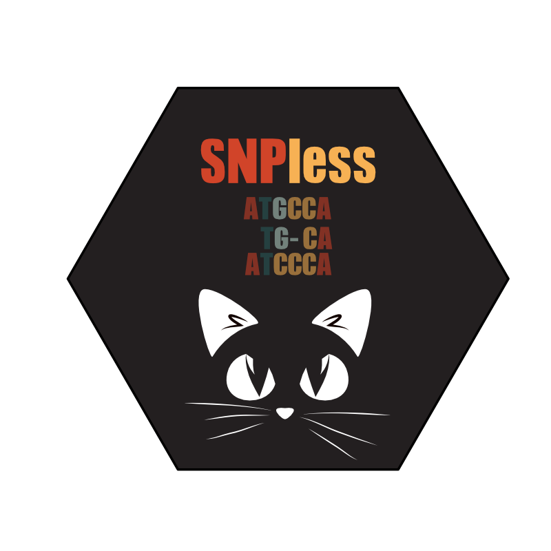

<a href="https://git.io/typing-svg"></a>

<h1 align="center"><b>SNPless powered by <span style="color: green;">Nextflow</span></b></h1>


snpless-nf - A Nextflow pipeline for time-course analysis with bacterial NGS whole-genome data. 

[](CODE_OF_CONDUCT.md)
[](http://opensource.org/licenses/MIT)
[](http://nextflow.io)

## Introduction

## Pipeline summary

1. QC
    1. FASTQC [FastQC](https://www.bioinformatics.babraham.ac.uk/projects/fastqc/)
    2. TRIM [Trimmomatic](http://www.usadellab.org/cms/?page=trimmomatic)
    3. PEAR [pear](https://cme.h-its.org/exelixis/web/software/pear/)
2. GENMAP [GenMap](https://github.com/cpockrandt/genmap)
3. ASSEMBLY
    1. UNICYCLER [Unicycler](https://github.com/rrwick/Unicycler)
    2. PROKKA [prokka](https://github.com/tseemann/prokka)
4. MAPPING
    1. BRESEQ [breseq](https://github.com/barricklab/breseq) >> SAMTOOLS [samtools](https://github.com/samtools/samtools) add read group
    2. MINIMAP2 [minimap2](https://github.com/lh3/minimap2) >> SAMBLASTER [samblaster](https://github.com/GregoryFaust/samblaster) remove duplicates
    3. BWA [BWA](http://bio-bwa.sourceforge.net/) >> SAMBLASTER [samblaster](https://github.com/GregoryFaust/samblaster) remove duplicates
    4. COVERAGE [samtools](https://github.com/samtools/samtools)
5. SNPCALLING
    1. FREEBAYES [freebayes](https://github.com/freebayes/freebayes) >> VCFFILTER [vcflib](https://github.com/vcflib/vcflib) >> VT [Vt](https://genome.sph.umich.edu/wiki/Vt) normalize >> decompose
    2. BCFTOOLS [bcftools](https://github.com/samtools/bcftools) mpileup, call, vcfutils.pl varFilter >>  VT [Vt](https://genome.sph.umich.edu/wiki/Vt) normalize >> decompose
    3. LOFREQ [LoFreq](http://csb5.github.io/lofreq/) indelqual, index, call-parallel
    4. VARSCAN [varscan](http://dkoboldt.github.io/varscan/) mpileup2snp, mpileup2indel
    5. MPILEUP [samtools](https://github.com/samtools/samtools) >> parse_mpileup.py >> annotate_pvalues
    6. GDCOMPARE [gdtools](https://barricklab.org/twiki/pub/Lab/ToolsBacterialGenomeResequencing/documentation/gd_usage.html)
6. SVCALLING
    1. PINDEL [pindel](https://github.com/genome/pindel)
    2. GRIDSS [GRIDSS](https://github.com/PapenfussLab/gridss)
7. FILTERING/MERGING
    1. BEDTOOLS [bedtools](https://bedtools.readthedocs.io/en/latest/)
8. ANNOTATION
    1. SNPEFF [SnpEff](http://pcingola.github.io/SnpEff/)
9. PLOTTING
    1. PLOT [R](https://cran.r-project.org/)

Addtional Tools used for data conversion and data analysis:

- HTSLIB [htslib](https://github.com/samtools/htslib)
- trajectory_pvalue_cpp_code [https://github.com/benjaminhgood/LTEE-metagenomic/tree/master/trajectory_pvalue_cpp_code](https://github.com/benjaminhgood/LTEE-metagenomic/tree/master/trajectory_pvalue_cpp_code) compiled into annotate_pvalues
- create_timecourse.py [https://github.com/benjaminhgood/LTEE-metagenomic/blob/master/cluster_scripts/create_timecourse.py](https://github.com/benjaminhgood/LTEE-metagenomic/blob/master/cluster_scripts/create_timecourse.py) used in parse_mpileup.py

## Quickstart

1. Install [Nextflow](https://www.nextflow.io/docs/latest/getstarted.html#installation) (>=21.10.0)

Install Nextflow by using the following command:

```
curl -s https://get.nextflow.io | bash
```

or

Install Nextflow by using conda:

```
conda create -n nf python=3
conda activate nf
conda install -c bioconda nextflow
```

2. Download the pipeline

```
git clone https://github.com/kullrich/snpless-nf.git
```

3. Test the pipeline on an minimal dataset with a single command:

Using nextflow conda environment:

```
conda activate nf
nextflow run snpless-nf -profile test
```

4. Start running your own analysis:

Check the necessary input files!

```
nextflow run snpless-nf --input <samples.tsv> --reference <genome.fna> --gff3 <genome.gff3> --proteins <genome.gbff>
```

## Full example dataset

### Get example files (8.6 GB)

Download via wget:

```
cd snpless-nf/examples
wget -O behringer2018.tar.gz https://owncloud.gwdg.de/index.php/s/fqD9ik2s3FReOUn/download
tar -xvf behringer2018.tar.gz
```

Download via weblink:

[behringer2018 - samples 113, 129, 221](https://ftp.evolbio.mpg.de/main.html?download&weblink=74b3a1f98426435d16a97bcc8e55b400&realfilename=behringer2018.tar.gz)

### Run full example dataset

Using nextflow conda environment:

```
conda activate nf
nextflow run snpless-nf --input behringer2018/behringer2018_113.txt --reference behringer2018/GCF_000005845.2_ASM584v2_genomic.fna --gff3 GCF_000005845.2_ASM584v2_genomic.gff --proteins behringer2018/GCF_000005845.2_ASM584v2_genomic.gbff
```

## Pipeline usage

see a detailed description here: [usage](https://github.com/kullrich/snpless-nf/blob/main/docs/usage.md)

### Input files

## Pipeline parameters

see a detailed description here: [parameters](https://github.com/kullrich/snpless-nf/blob/main/docs/parameters.md)

## Pipeline output

see a detailed description here: [output](https://github.com/kullrich/snpless-nf/blob/main/docs/output.md)

## Licence

MIT (see LICENSE)

## Contributing Code

If you would like to contribute to snpless-nf, please file an issue so that one can establish a statement of need, avoid redundant work, and track progress on your contribution.

Before you do a pull request, you should always file an issue and make sure that someone from the snpless-nf developer team agrees that it’s a problem, and is happy with your basic proposal for fixing it.

Once an issue has been filed and we've identified how to best orient your contribution with package development as a whole, [fork](https://docs.github.com/en/github/getting-started-with-github/fork-a-repo) the [main repo](https://github.com/kullrich/snpless-nf.git), branch off a [feature branch](https://docs.github.com/en/github/collaborating-with-issues-and-pull-requests/about-branches) from `master`, [commit](https://docs.github.com/en/desktop/contributing-and-collaborating-using-github-desktop/committing-and-reviewing-changes-to-your-project) and [push](https://docs.github.com/en/github/using-git/pushing-commits-to-a-remote-repository) your changes to your fork and submit a [pull request](https://docs.github.com/en/github/collaborating-with-issues-and-pull-requests/proposing-changes-to-your-work-with-pull-requests) for `snpless-nf:master`.

By contributing to this project, you agree to abide by the Code of Conduct terms.

## Bug reports

Please report any errors or requests regarding [snpless-nf](https://github.com/kullrich/snpless-nf) to Kristian Ullrich (ullrich@evolbio.mpg.de)

## Code of Conduct - Participation guidelines

This repository adhere to [Contributor Covenant](http://contributor-covenant.org) code of conduct for in any interactions you have within this project. (see [Code of Conduct](https://github.com/kullrich/snpless-nf/-/blob/master/CODE_OF_CONDUCT.md))

See also the policy against sexualized discrimination, harassment and violence for the Max Planck Society [Code-of-Conduct](https://www.mpg.de/11961177/code-of-conduct-en.pdf).

By contributing to this project, you agree to abide by its terms.

## References - Examples

Behringer, Megan G., et al. "Escherichia coli cultures maintain stable subpopulation structure during long-term evolution." Proceedings of the National Academy of Sciences 115.20 (2018): E4642-E4650. [https://www.pnas.org/content/115/20/E4642.short](https://www.pnas.org/content/115/20/E4642.short)

## References - Tools
1. Good, Benjamin H., et al. "The dynamics of molecular evolution over 60,000 generations." Nature 551.7678 (2017): 45-50. [link](https://www.nature.com/articles/nature24287)
2. Di Tommaso, Paolo, et al. "Nextflow enables reproducible computational workflows." Nature biotechnology 35.4 (2017): 316-319. [link](https://www.nature.com/articles/nbt.3820?report=reader)
3. Andrews, Simon. "FastQC: a quality control tool for high throughput sequence data. 2010." (2017): W29-33. [link](https://www.bioinformatics.babraham.ac.uk/projects/fastqc/)
4.Bolger, Anthony M., Marc Lohse, and Bjoern Usadel. "Trimmomatic: a flexible trimmer for Illumina sequence data." Bioinformatics 30.15 (2014): 2114-2120. [link](https://academic.oup.com/bioinformatics/article/30/15/2114/2390096?login=true)
5. Zhang, Jiajie, et al. "PEAR: a fast and accurate Illumina Paired-End reAd mergeR." Bioinformatics 30.5 (2014): 614-620. [link](https://academic.oup.com/bioinformatics/article/30/5/614/247231?login=true)
6. Pockrandt, Christopher, et al. "GenMap: ultra-fast computation of genome mappability." Bioinformatics 36.12 (2020): 3687-3692. [link](https://academic.oup.com/bioinformatics/article/36/12/3687/5815974?login=true)
7. Wick, Ryan R., et al. "Unicycler: resolving bacterial genome assemblies from short and long sequencing reads." PLoS computational biology 13.6 (2017): e1005595. [link](https://journals.plos.org/ploscompbiol/article?id=10.1371/journal.pcbi.1005595)
8. Seemann, Torsten. "Prokka: rapid prokaryotic genome annotation." Bioinformatics 30.14 (2014): 2068-2069. [link](https://academic.oup.com/bioinformatics/article/30/14/2068/2390517?login=true)
9. Deatherage, Daniel E., and Jeffrey E. Barrick. "Identification of mutations in laboratory-evolved microbes from next-generation sequencing data using breseq." Engineering and analyzing multicellular systems. Humana Press, New York, NY, 2014. 165-188. [link](https://link.springer.com/content/pdf/10.1007/978-1-4939-0554-6_12.pdf)
10. Li, Heng. "Minimap2: pairwise alignment for nucleotide sequences." Bioinformatics 34.18 (2018): 3094-3100. [link](https://academic.oup.com/bioinformatics/article/34/18/3094/4994778?login=true)
11. Li, Heng. "Aligning sequence reads, clone sequences and assembly contigs with BWA-MEM." arXiv preprint arXiv:1303.3997 (2013). [link](https://arxiv.org/abs/1303.3997)
12. Faust, Gregory G., and Ira M. Hall. "SAMBLASTER: fast duplicate marking and structural variant read extraction." Bioinformatics 30.17 (2014): 2503-2505. [link](https://academic.oup.com/bioinformatics/article/30/17/2503/2748175?login=true)
13. Li, Heng, et al. "The sequence alignment/map format and SAMtools." Bioinformatics 25.16 (2009): 2078-2079. [link](https://academic.oup.com/bioinformatics/article/25/16/2078/204688?login=true)
14. Garrison, Erik, and Gabor Marth. "Haplotype-based variant detection from short-read sequencing." arXiv preprint arXiv:1207.3907 (2012). [link](https://arxiv.org/abs/1207.3907)
15. Wilm, Andreas, et al. "LoFreq: a sequence-quality aware, ultra-sensitive variant caller for uncovering cell-population heterogeneity from high-throughput sequencing datasets." Nucleic acids research 40.22 (2012): 11189-11201. [link](https://academic.oup.com/nar/article/40/22/11189/1152727?login=true)
16. Koboldt, Daniel C., et al. "VarScan 2: somatic mutation and copy number alteration discovery in cancer by exome sequencing." Genome research 22.3 (2012): 568-576. [link](https://genome.cshlp.org/content/22/3/568.short)
17. Ye, Kai, et al. "Pindel: a pattern growth approach to detect break points of large deletions and medium sized insertions from paired-end short reads." Bioinformatics 25.21 (2009): 2865-2871. [link](https://academic.oup.com/bioinformatics/article/25/21/2865/2112044?login=true)
18. Cameron, Daniel L., et al. "GRIDSS2: comprehensive characterisation of somatic structural variation using single breakend variants and structural variant phasing." bioRxiv (2021): 2020-07. [link](https://genomebiology.biomedcentral.com/articles/10.1186/s13059-021-02423-x)
19. Quinlan, Aaron R., and Ira M. Hall. "BEDTools: a flexible suite of utilities for comparing genomic features." Bioinformatics 26.6 (2010): 841-842. [link](https://academic.oup.com/bioinformatics/article/26/6/841/244688?login=true)
20. Cingolani, Pablo, et al. "A program for annotating and predicting the effects of single nucleotide polymorphisms, SnpEff: SNPs in the genome of Drosophila melanogaster strain w1118; iso-2; iso-3." Fly 6.2 (2012): 80-92. [link](https://www.tandfonline.com/doi/full/10.4161/fly.19695)
21. Wickham, Hadley. "ggplot2." Wiley Interdisciplinary Reviews: Computational Statistics 3.2 (2011): 180-185. [link](https://wires.onlinelibrary.wiley.com/doi/full/10.1002/wics.147)
 
